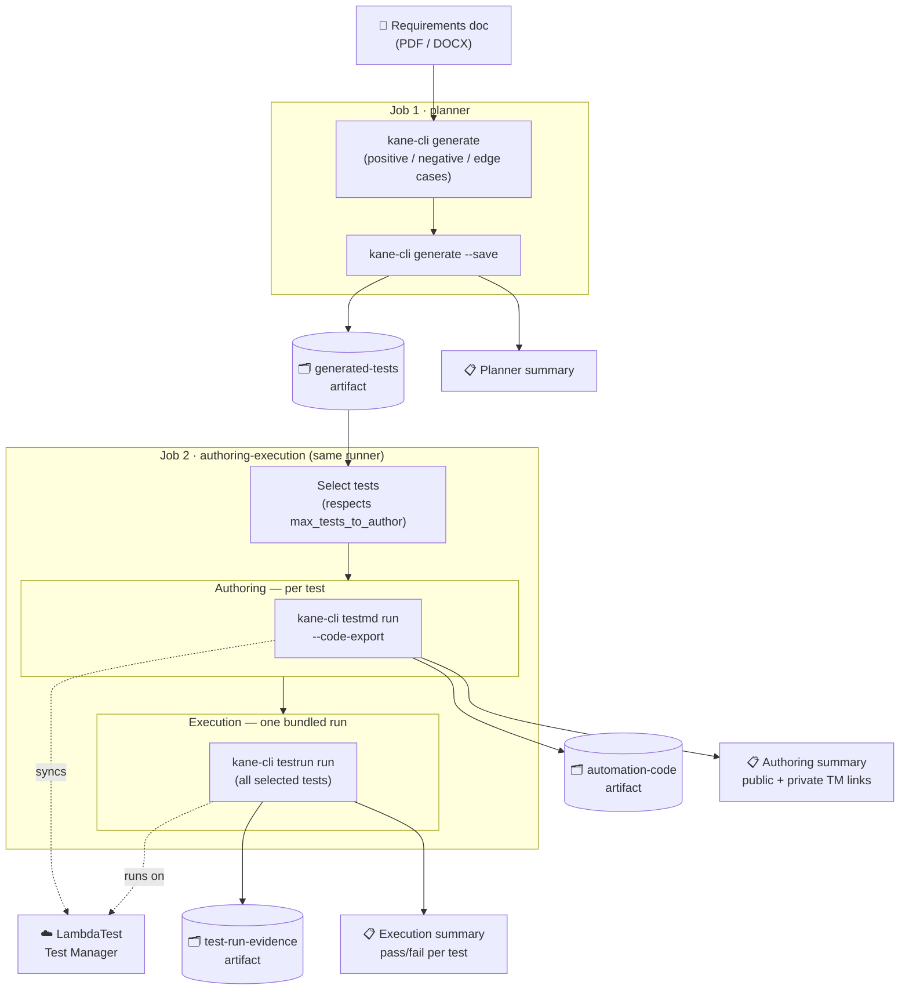

# Agentic Test Pipeline

An AI-driven test pipeline: drop a requirements document (PDF/DOCX) into the repo, and a GitHub Actions workflow reads it, generates test cases, authors runnable automation code for them, and executes that automation against [LambdaTest](https://www.lambdatest.com/), publishing results as job summaries and downloadable artifacts.

Built on [`kane-cli`](https://www.testmuai.com/support/docs/kane-cli-introduction) (LambdaTest's AI test-authoring CLI).

## How it works

The workflow (`.github/workflows/agentic-test-pipeline.yml`) has 2 jobs:

1. **`planner`** — reads the requirements document and generates test cases from it (`kane-cli generate`), covering positive, negative, and edge cases. Saves them as `*_test.md` files.
2. **`authoring-execution`** — one job, two stages back to back:
   - **Authoring**: runs each generated test once (`kane-cli testmd run --code-export`), which syncs it to LambdaTest Test Manager and exports standalone Playwright automation code (JavaScript or Python).
   - **Execution**: bundles all the authored tests into a single LambdaTest test run (`kane-cli testrun run`) and reports pass/fail results.

Every job publishes a **GitHub Actions job summary** (visible on the run page) and uploads artifacts you can download from the run.



## One-time setup

### 1. Add repository secrets

Go to **Settings → Secrets and variables → Actions** on this repo and add:

| Secret | What it is |
|---|---|
| `KANE_USERNAME` | Your kane-cli / LambdaTest account username (same as `kane-cli login --username`) |
| `KANE_ACCESS_KEY` | Your kane-cli / LambdaTest access key (same as `kane-cli login --access-key`) |
| `LT_USERNAME` | LambdaTest username (used during execution) |
| `LT_ACCESS_KEY` | LambdaTest access key (used during execution) |

Without these, every run fails immediately at the `kane-cli login` step.

### 2. Add a requirements document

Drop a PDF or DOCX requirements/PRD/spec into the repo (root, or anywhere — you can point at it explicitly). This repo already has `Airbnb_Search_Routing_PRD.pdf` as an example.

## Running the pipeline

Go to the **Actions** tab → **Agentic Test Pipeline** → **Run workflow**, and fill in the inputs (all optional):

| Input | Default | What it does |
|---|---|---|
| `requirements_doc` | *(blank → auto-detects the first `*.pdf`/`*.docx` in the repo root)* | Path to the requirements document, **relative to the repo root** (e.g. `Airbnb_Search_Routing_PRD.pdf`) — not a github.com URL. |
| `generation_objective` | positive/negative/edge-case prompt | The instruction passed to `kane-cli generate`. Override this to steer what kind of coverage gets generated. |
| `test_language` | `javascript` | `javascript` or `python` — the language for the exported automation code. |
| `max_tests_to_author` | `0` (no cap) | Caps how many of the planner's generated tests actually get authored and run. Useful for a cheap smoke-test trigger before authoring the full suite. |
| `kane_project_id` | *(blank → account default)* | LambdaTest/kane-cli project ID. Leave blank to use your account's default project. |
| `kane_folder_id` | *(blank → account default)* | LambdaTest/kane-cli folder ID within the project. Leave blank to use the default folder. |

Click **Run workflow**. There's no automatic trigger on push/PR by default — planner and authoring each call a paid AI generation/execution API, so runs are manual-only to control cost. (You can add a `push`/`pull_request` trigger yourself once you're comfortable with the cost profile.)

## Reading the results

Each job's **Summary** (visible on the run page, or via **Actions → \[run\] → Summary**) shows:

- **Planner summary** — which document was used, the kane-cli request ID, and a note that `generated-tests` was uploaded as an artifact.
- **Authoring summary** — a table of every authored test with its real LambdaTest Test Manager links: a **public** link (no login required) and a **private** link (requires being logged into your LambdaTest account), plus the `automation-code` artifact.
- **Execution summary** — a pass/fail/duration table for every test in the bundled test run, overall totals, and the evidence pack (see below).

### Artifacts (download from the run page)

| Artifact | Contents |
|---|---|
| `generated-tests` | The raw `*_test.md` test case files |
| `automation-code` | Exported standalone Playwright automation code (`test.js`/`test.py` + deps) |
| `test-run-evidence` | The sealed evidence pack (`.evidence` file) from the bundled test run — view it locally with `kane-cli evidence serve <file>.evidence` |

**Note:** the bundled test run (`kane-cli testrun run`) doesn't produce a hosted LambdaTest dashboard link of its own — only the authoring stage's individual test runs do (that's where the public/private links in the authoring summary come from).

## Running locally

You can reproduce any stage on your own machine with `kane-cli` installed (`npm install -g @testmuai/kane-cli`) and logged in (`kane-cli login`):

```bash
# Generate test cases from a requirements doc
kane-cli generate "generate test cases for the requirements in the attached document, covering positive, negative, and edge cases for each functional requirement" \
  --files ./Airbnb_Search_Routing_PRD.pdf --agent
kane-cli generate --save --req <request_id> --agent

# Author + export one generated test
kane-cli testmd run .testmuai/tests/<suite>/<scenario>/<name>_test.md \
  --headless --agent --code-export --code-language javascript

# Bundle multiple authored tests into one LambdaTest test run
kane-cli testrun run <file1>_test.md <file2>_test.md --headless --on-failure continue

# View a downloaded evidence pack
kane-cli evidence serve <file>.evidence
```

## Reusing this pipeline in another repo

The workflow supports `workflow_call`, so another repo can invoke it directly instead of copy-pasting the YAML:

```yaml
jobs:
  tests:
    uses: mayank2193/agenticflow/.github/workflows/agentic-test-pipeline.yml@master
    with:
      requirements_doc: docs/my-new-prd.pdf
    secrets: inherit
```
